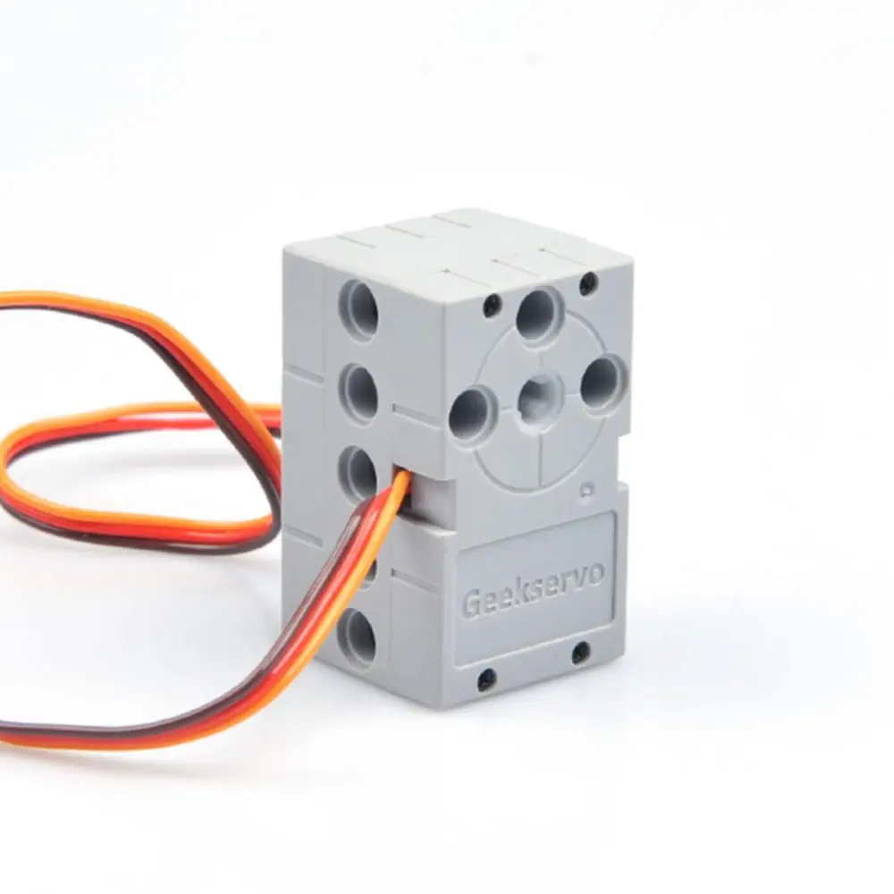
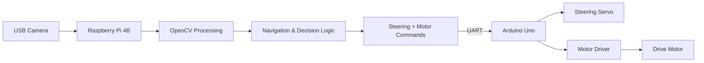
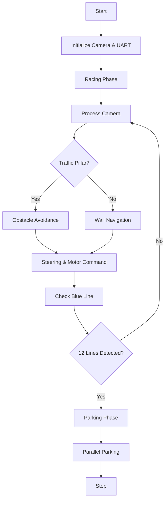
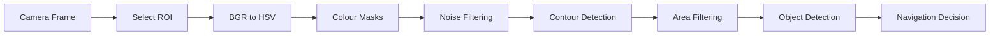
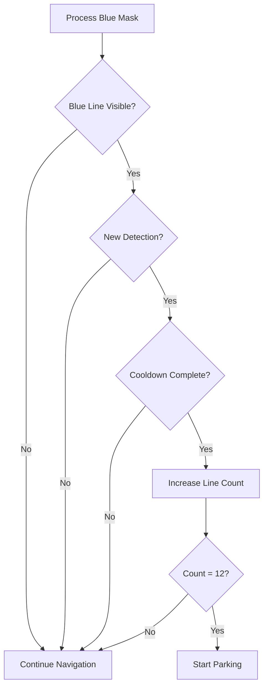
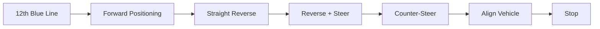

**WRO-FUTURE-ENGINEERS-2026_THE MECH MINDS**

Welcome to the official technical repository for Team TMM's autonomous self-driving vehicle developed for the WRO Future Engineers category. This codebase powers our dual-microarchitecture robot engineered for precision wall-keeping, dynamic obstacle avoidance, robust lap counting, and automated parallel parking.

## Team members: 
Ahmed Suleiman, Ismail Nassor, & Hajer Al Salmani. 
Coach: Alex Savariyar.

## Table of contents:
1. system Overview.
2. Hardware Components.
3. Power System & Safety.
4. Wiring.
5. Raspberry Pi Setup.
6. Software Environmnet.
7. GPIO Pin Assignment.
8. Design Decisions & Iteration.
9. Autonomous Driving Strategy.
10. Running Autonomously at Boot.
11. Safe Shutdown.
12. Pre-Run Checklist.
13. Troubleshooting.
14. Repository Structure.

## 1. System Overview

Our robot uses a **hybrid control architecture** in which the **Raspberry Pi 4B** performs computer vision, autonomous navigation, and decision-making, while the **Arduino Uno** handles real-time steering and motor control.

This separation allows the Raspberry Pi to focus on computationally intensive vision processing while the Arduino provides stable and responsive control of the robot's actuators.

### Raspberry Pi 4B – Vision and Decision-Making

The Raspberry Pi 4B acts as the main processing unit of the robot. A 640×480 wide-angle USB camera continuously provides images of the track. These frames are processed using an OpenCV-based Python program.

The Raspberry Pi is responsible for:

* Capturing and processing live camera frames.
* Processing selected **Regions of Interest (ROI)** for navigation.
* Detecting track boundaries for wall-based navigation.
* Detecting **red and green traffic pillars** and determining the appropriate avoidance direction.
* Detecting the **blue lap-counting line**.
* Applying debounce logic to prevent repeated lap counts.
* Tracking lap progress, where **12 validated blue-line detections represent three completed laps**.
* Managing navigation states such as normal driving, obstacle avoidance, lap completion, parking search, and parallel parking.
* Calculating the required steering position and motor speed.
* Sending steering and motor commands to the Arduino Uno through serial communication.

### Arduino Uno – Motion Control

The Arduino Uno acts as the robot's low-level motion controller.

It receives steering and motor commands from the Raspberry Pi through serial communication and converts them into stable signals for the steering servo and drive motor.

The communication packet follows the format:

`servoValue,motorValue`

For example:

`1050,120`

The first value represents the steering command and the second value represents the motor command.

The Arduino Uno is responsible for:

* Receiving serial commands from the Raspberry Pi.
* Validating the received command values.
* Generating the required PWM signal for the steering servo.
* Applying steering-direction correction according to the mechanical steering arrangement.
* Controlling the motor driver.
* Controlling the direction and speed of the DC drive motor.
* Maintaining stable actuator control independently of the Raspberry Pi's computer-vision workload.
* Applying a communication watchdog to stop the robot if valid commands are not received within the expected time.

### System Components

| Subsystem             | Main Component                     | Function                                                                               |
| --------------------- | ---------------------------------- | -------------------------------------------------------------------------------------- |
| **Perception**        | 640×480 wide-angle USB camera      | Captures the track, traffic pillars, lap-counting line, and parking markers            |
| **Main Processing**   | Raspberry Pi 4B                    | Performs computer vision, autonomous navigation, decision-making, and state management |
| **Motion Controller** | Arduino Uno                        | Receives motion commands from the Raspberry Pi and controls the actuators              |
| **Steering**          | Servo motor                        | Controls the steering angle of the front wheels                                        |
| **Motor Control**     | Motor driver                       | Controls the direction and speed of the DC drive motor                                 |
| **Propulsion**        | DC motor and mechanical drivetrain | Transfers motor power to the drive wheels                                              |
| **Power System**      | Separate regulated power supplies  | Provides stable power to the Raspberry Pi, Arduino, servo, and drive system            |

### System Data Flow Diagram


### Control Flow

The overall control sequence of the robot is:

**Camera → Raspberry Pi → Arduino Uno → Steering Servo / Motor Driver → DC Motor → Drive Wheels**

1. The **USB camera** captures the track environment.
2. The **Raspberry Pi 4B** processes the camera frames using OpenCV.
3. The Raspberry Pi determines the required steering position and motor speed.
4. The steering and motor values are transmitted to the **Arduino Uno** through serial communication.
5. The Arduino generates the required PWM signal for the **steering servo**.
6. The Arduino sends speed and direction signals to the **motor driver**.
7. The motor driver controls the **DC drive motor**.
8. The mechanical drivetrain transfers motor rotation to the drive wheels.

## 2. Hardware Components

The robot uses the following main electronic, mechanical, and power components.

|   No. | Component                         | Image                                              | Specification / Function                                                                                                                                                                                                                                                     |
| ----: | --------------------------------- | -------------------------------------------------- | ---------------------------------------------------------------------------------------------------------------------------------------------------------------------------------------------------------------------------------------------------------------------------- |
| **1** | **Controller & Vision Processor** |  | **Raspberry Pi 4B** — Runs Python and OpenCV computer-vision pipelines. Handles Region of Interest (ROI) wall tracking, red/green traffic-pillar detection, edge-debounced blue-line lap counting, autonomous navigation, and the parallel-parking state machine.            |
| **2** | **Camera**                        |       | **USB Camera — 640×480, 30 fps, ~130° FOV** — Provides real-time visual input for track observation, wall detection, traffic-pillar detection, lap-line detection, and parking-marker recognition.                                                                           |
| **3** | **Motor Driver**                  |     | **TB6612-type Dual DC Motor Driver** — Interfaces between the Arduino Uno, motor power supply, and DC motors. Controls motor direction and speed.                                                                                                                            |
| **4** | **Drive Motors**                  |        | **DC Motor** — Provide propulsion to the robot through the mechanical drivetrain.                                                                                                                                                                                       |
| **5** | **Steering Mechanism**            |   | **3-Hobby Servo** — Controls the front-wheel steering mechanism according to steering commands received from the Arduino Uno.                                                                                                                                           |
| **6** | **Steering & Motor Coprocessor**  |      | **Arduino Uno** — Receives continuous CSV command packets (`servoVal,motorVal\n`) from the Raspberry Pi through hardware UART (`/dev/serial0`). It generates the servo PWM signal and controls the motor driver, offloading low-level actuator timing from the Raspberry Pi. |
| **7** | **Raspberry Pi Power Supply**     |       | **30 W USB Power Bank — 5 V / 3 A output** — Provides a stable independent power supply for the Raspberry Pi.                                                                                                                                                                |
| **8** | **Motor Power Supply**            |     | **7.4 V Battery Pack** — Supplies the motor driver's VM power rail for robot propulsion.                                                                                                                                                                 |
## 3. Mobility & Mechanical Design

Our robot uses a **four-wheel automotive-style layout** with front-wheel steering and rear-wheel propulsion.

The drivetrain uses **two DC geared motors**, both connected through gears to the **same rear axle**. The rear wheels are therefore mechanically linked and are not controlled independently.

### Chassis and Drivetrain


Using two motors provides additional torque while keeping both rear wheels mechanically connected through the same axle.

### Steering Mechanism

The two front wheels are controlled by a single servo through a steering linkage.

 

Steering is controlled independently from propulsion, giving the vehicle predictable automotive-style movement.

### Torque and Speed Considerations

The drivetrain was designed to balance **speed and torque**.

Higher torque helps the robot accelerate reliably and overcome drivetrain friction, while excessive speed can reduce stability and make obstacle detection and steering corrections less reliable.

The final motor speed and gearing are therefore selected based on **consistent track performance rather than maximum speed**.

### Design Trade-Offs

| Design Choice            | Advantage                          | Trade-Off                                    |
| ------------------------ | ---------------------------------- | -------------------------------------------- |
| **Two DC motors**        | Higher available torque            | Increased power consumption                  |
| **Common rear axle**     | Simple and reliable drivetrain     | Some wheel slip may occur during tight turns |
| **Gear transmission**    | Allows speed and torque adjustment | Requires accurate alignment                  |
| **Front servo steering** | Precise directional control        | Requires careful calibration                 |

### Mechanical Testing

The drivetrain and steering system are tested for:

* Straight-line movement
* Steering-centre accuracy
* Turning radius
* Motor speed and torque
* Gear alignment
* Rear-wheel traction
* Chassis stability

Mechanical adjustments are made based on repeated track testing to improve reliability and consistency.

### Final Mobility Architecture

The final vehicle uses **two mechanically coupled DC motors driving a common rear axle through gears, combined with servo-controlled front-wheel steering**.

## 4. Power & Sensor Architecture

### 4.1 Power Distribution

The robot uses separate power sources for the computing and propulsion/control systems.

- **Raspberry Pi 4B:** Powered by a 30 W USB power bank providing 5 V / 3 A.
- **Drive Motors:** Powered by a dedicated 7.4 V battery through the motor driver.
- **Arduino Uno:** Powered by a separate 7.4 V battery through the VIN/barrel input.
- **Steering Servo:** Powered from the Arduino Uno 5 V output.
- **Common Ground:** The Raspberry Pi, Arduino Uno, motor driver, servo, and battery grounds are connected to provide a common reference for control signals.

 

### 4.2 Electrical Circuit Diagram
The complete electrical circuit of the robot was designed using **Cirkit Designer**. The diagram shows the connections between the Raspberry Pi 4B, Arduino Uno, motor driver, steering servo, drive motors, and the separate power supplies.


_[Note on the circuit diagram: The electrical diagram above was built in Cirkit Designer to illustrate how the components are connected to each other — it is not a physical layout or an exact part-for-part match of the robot. Some components shown (including the Raspberry Pi camera connection) use the closest available part in the diagram tool's library, since the exact parts used on the robot weren't available there. In particular, the diagram shows the camera connected through the Raspberry Pi's dedicated camera port, but the robot actually uses a standard USB camera connected through a USB port, not the Pi's camera connector. The diagram should be read as a reference for signal/power connections between components, not as a literal reproduction of the physical wiring.]_

The **Raspberry Pi 4B** performs computer vision, navigation, and autonomous decision-making. Motion commands are transmitted to the **Arduino Uno** through serial communication.

The Arduino Uno then:

* Generates the PWM signal for the steering servo.
* Sends speed and direction control signals to the motor driver.
* Controls both DC drive motors through the motor driver.

The circuit also includes the separate power connections described in Section 4.1, including the Raspberry Pi power bank and the two 7.4 V battery supplies.

### 4.3 Controller and Motor Driver Connections
| From | To | Function |
|---|---|---|
| Raspberry Pi TX (`/dev/serial0`, Pin 8 / GPIO14) | Arduino Uno RX (Pin 0) | UART command communication |
| Raspberry Pi GND | Arduino Uno GND | Common signal reference |
| Arduino Pin 9 | Steering Servo Signal | Steering PWM control |
| Arduino 5V | Steering Servo V+ | Servo power supply |
| Arduino GND | Steering Servo GND | Servo ground |
| Arduino Pin 3 | Motor Driver AIN1 | Motor direction control |
| Arduino Pin 5 | Motor Driver AIN2 | Motor direction control |
| Arduino Pin 4 | Motor Driver STBY | Motor driver standby / enable |
| 7.4 V Battery 1 | Motor Driver VM | Drive motor power supply |
| 7.4 V Battery 2 | Arduino Uno VIN / Barrel Input | Arduino power supply |
| Motor Driver Outputs | DC Motor 1 & DC Motor 2 | Motor propulsion |
| Common GND | Raspberry Pi, Arduino, Motor Driver & Batteries | Shared electrical reference |

### 4.4 Camera Placement

A single **640×480 wide-angle USB camera** is mounted at the front of the robot.

The camera position was selected to provide clear visibility of:

- Track boundaries ahead of the vehicle.
- Red and green traffic pillars.
- Blue lap-reference lines.
- The parking area and parking markers.

The mounting height and viewing angle were adjusted through track testing. The lower part of the image is used mainly for nearby track and steering information, while the upper part provides sufficient look-ahead distance for navigation and obstacle detection.

| Parameter | Camera Setup |
|---|---|
| **Camera Resolution** | 640×480 |
| **Frame Rate** | 30 fps |
| **Camera Height** | 8 CM from ground |
| **Camera Angle** | 90 Degree against ground |
| **Viewing Direction** | Forward-facing |
| **Approximate Field of View** | ~130° |
| **Mounting Position** | Front section of the robot |

The final camera position was selected to balance **near-field track detection** with **forward visibility**, improving steering decisions and early detection of traffic pillars.
#### Camera View

The following image shows the forward view captured by the USB camera during track testing.


**Figure 4.4.1. Forward camera view used for autonomous navigation.**

The image below shows the main image-processing regions used by the navigation algorithm.


**Figure 4.4.2. Camera frame with the main Regions of Interest used for wall tracking, traffic-pillar detection, and lap-line detection.**

### 4.5 Camera Calibration
The computer-vision system was calibrated using images captured from the actual test field.

Camera frames are captured in **BGR format** and converted to **HSV (Hue, Saturation, Value)** before colour detection. HSV was selected because it provides more reliable colour separation under changing lighting conditions.

Calibration included:

* Adjusting HSV thresholds for **red traffic pillars**.
* Adjusting HSV thresholds for **green traffic pillars**.
* Adjusting HSV thresholds for the **blue lap-reference line**.
* Selecting suitable **Regions of Interest (ROI)**.
* Adjusting minimum contour-area thresholds to reduce false detections.
* Testing the thresholds under different lighting conditions.

#### Colour Detection Calibration

The following images show the main stages of the colour-detection process:

**Original Camera Frame → HSV Mask → Detected Object**

| Detection         | Processing                                               |
| ----------------- | -------------------------------------------------------- |
| **Green Pillar**  | Original Frame → Green HSV Mask → Green Pillar Detection |
| **Red Pillar**    | Original Frame → Red HSV Mask → Red Pillar Detection     |
| **Blue Lap Line** | Original Frame → Blue HSV Mask → Lap-Line Detection      |


**Figure 4.5. HSV colour calibration and detection results for traffic pillars and the blue lap-reference line.**

The final HSV ranges and contour thresholds were selected through repeated track testing to achieve stable detection while reducing false positives.


### 4.6 Power Budget
The robot uses separate power sources for the Raspberry Pi, Arduino, and drive motors. This helps the robot operate more reliably during movement.

| Component           |     Voltage | Approx. Current | Power Source                       |
| ------------------- | ----------: | --------------: | ---------------------------------- |
| **Raspberry Pi 4B** |         5 V |        ~1–1.5 A | 30 W USB power bank                |
| **USB Camera**      |         5 V |          ~0.2 A | Raspberry Pi USB                   |
| **Arduino Uno**     | 7.4 V input |       ~50–80 mA | 2 × 3.7 V 18650 batteries          |
| **Steering Servo**  |         5 V |      ~0.2–0.6 A | Arduino 5 V                        |
| **Motor Driver**    |       7.4 V |               — | 2 × 3.7 V 18650 batteries          |
| **DC Motor 1**      |       7.4 V |      ~0.3–0.8 A | Motor battery through motor driver |
| **DC Motor 2**      |       7.4 V |      ~0.3–0.8 A | Motor battery through motor driver |

The Raspberry Pi uses a separate USB power bank, while the Arduino and motor driver use separate 18650 battery packs. This helps prevent the drive motors from affecting the Raspberry Pi during operation.

*The current values shown are approximate and may vary depending on load.*

### 4.7 Electrical Failure Considerations

| Potential Failure                           | Effect                                   | Protection / Mitigation                                         |
| ------------------------------------------- | ---------------------------------------- | --------------------------------------------------------------- |
| **Low motor-battery voltage**               | Reduced motor speed and torque           | Battery voltage checked before each run                         |
| **Unstable 9 V battery supply**             | Weak motor and servo performance         | Replaced with 2 × 3.7 V 18650 battery packs                     |
| **Servo jitter / unstable control**         | Steering becomes inaccurate              | Servo control moved from Raspberry Pi to Arduino Uno            |
| **Loose power connection**                  | Sudden loss of power or control          | Connectors inspected before each run                            |
| **Common-ground failure**                   | Unstable or incorrect control signals    | Ground connections checked before operation                     |
| **Serial communication loss**               | Motor or steering commands stop updating | Arduino watchdog stops the vehicle safely                       |
| **Raspberry Pi power interruption**         | Vision and navigation stop               | Raspberry Pi uses an independent 30 W USB power bank            |
| **Motor electrical load affecting control** | Unstable actuator behaviour              | Separate power paths used for Raspberry Pi, Arduino, and motors |
 
  
## 5. Software Architecture & Autonomous Strategy

The autonomous software is divided between the **Raspberry Pi 4B** and the **Arduino Uno**. The Raspberry Pi handles computer vision, navigation, obstacle detection, lap counting, and parking decisions, while the Arduino Uno controls the steering servo and drive motor in real time.

### 5.1 Software Overview

The Raspberry Pi processes the camera image using OpenCV and calculates the required steering and motor commands. These commands are sent to the Arduino Uno through serial communication.



**Figure 5.1. Software and control architecture.**

### 5.2 Main State Machine

The robot operates mainly in two phases: **Racing** and **Parking**. During racing, it performs wall navigation, traffic-pillar avoidance, and lap counting. After completing three laps, it automatically enters the parking phase.



**Figure 5.2. Main autonomous state machine.**

### 5.3 Camera Processing Pipeline

The USB camera captures frames at **640×480 resolution**. The software selects the required Region of Interest (ROI), converts the image to HSV, creates colour masks, and identifies useful objects from detected contours.



**Figure 5.3. Camera-processing pipeline.**

### 5.4 Track / Wall Navigation

The lower region of the camera image is used to detect the left and right track boundaries. The robot adjusts its steering to remain safely between the walls.

If one wall temporarily disappears, the system uses the last valid turning direction for a short period to maintain stable movement.

### 5.5 Red and Green Traffic Pillar Detection

Red and green traffic pillars are detected using HSV colour masks and contour filtering.

* **Green pillar:** The robot steers left to avoid it.
* **Red pillar:** The robot steers right to avoid it.
* The largest valid contour is treated as the closest and most important obstacle.

### 5.6 Steering Decision

Steering commands are calculated from the detected walls and traffic pillars.

The Raspberry Pi selects the required steering position and sends the value to the Arduino Uno. Motor speed is also reduced during turns or obstacle avoidance to improve stability.

Typical steering reference values are:

| Direction  | Servo Value |
| ---------- | ----------: |
| **Left**   |     1750 µs |
| **Centre** |     1880 µs |
| **Right**  |     2150 µs |

### 5.7 Blue-Line Lap Counting

The blue reference line is detected using an HSV colour mask. Debounce and cooldown logic prevent the same physical line from being counted more than once.

Every four valid blue-line detections represent one lap. After **12 detections**, the robot completes three laps and switches to the parking phase.



**Figure 5.4. Blue-line lap-counting logic.**

### 5.8 Serial Communication

The Raspberry Pi communicates with the Arduino Uno through hardware UART using `/dev/serial0`.

Commands are transmitted in a simple CSV format:

```text
servoVal,motorVal
```

Example:

```text
1880,60
```

The Arduino reads the values and immediately applies the required steering and motor output.

### 5.9 Parallel Parking

After the 12th blue-line detection, the robot automatically starts the parking sequence.

The sequence consists of forward positioning, reversing, steering into the parking area, counter-steering for alignment, and stopping inside the parking bay.



**Figure 5.5. Automated parallel-parking sequence.**

### 5.10 Safety Watchdog / Fail-Safe

The Arduino continuously checks whether valid commands are being received from the Raspberry Pi.

If communication is lost for approximately **1000 ms**, the Arduino automatically:

* Stops the drive motor.
* Returns the steering servo to its centre position.

This prevents uncontrolled movement if the Raspberry Pi freezes, disconnects, or stops sending commands.

## 6. Engineering Decisions & Iterations

The robot was improved through repeated mechanical, electrical, and software testing. The main engineering changes made during development are summarized below.

| Initial Issue                                                                     | Engineering Change                                                | Result                                             |
| --------------------------------------------------------------------------------- | ----------------------------------------------------------------- | -------------------------------------------------- |
| Servo control became unstable while the Raspberry Pi was processing camera frames | Steering and motor control were moved to the Arduino Uno          | More stable actuator control                       |
| Robot did not travel straight consistently                                        | Servo centre and steering limits were recalibrated                | Improved straight-line movement and turning        |
| Robot overshot corners at higher speed                                            | Motor speed was reduced during sharp turns and obstacle avoidance | Better cornering stability                         |
| Left and right turns behaved differently                                          | Batteries and heavy components were repositioned                  | Improved weight balance                            |
| 9 V batteries provided weak motor performance                                     | Replaced with 7.4 V battery packs using 18650 cells               | Improved torque and reliability                    |
| Blue line remained visible across multiple frames                                 | Added debounce and cooldown logic                                 | Prevented duplicate lap counts                     |
| Loss of serial commands could leave an old actuator command active                | Added an Arduino communication watchdog                           | Robot stops safely if communication is interrupted |

### Key Architectural Decision

One of the most important changes was separating the robot's high-level and low-level processing.

The **Raspberry Pi 4B** now concentrates on computer vision, navigation, lap counting, and parking decisions, while the **Arduino Uno** manages steering and motor control.

This architecture was retained because it provided more stable actuator control while allowing the Raspberry Pi to concentrate on computationally intensive OpenCV processing.

### Development Approach

Each major modification was tested on the track before being incorporated into the final robot. Changes were retained only when they improved reliability, steering stability, navigation accuracy, or overall consistency.


