# The Mech Minds · WRO Future Engineers 2026

Our autonomous vehicle for the WRO Future Engineers category. This page documents the **current Raspberry Pi 5 + Build HAT version**. The [project guide](https://tmm-robot-control-guide.alexmartyn88.chatgpt.site) explains the decisions interactively.

> **Current files:** [`src/main.py`](src/main.py) and [`src/vision.py`](src/vision.py) are the supplied Pi 5 programs. `src/vehicle.py` now provides the Build HAT motor methods called by `main.py`; its speed, motor ports and steering positions are configurable defaults that need physical calibration. Other files in `src/` belong to the earlier Pi 4B + Arduino prototype. The old `arduino/` folder has been removed; its UART wiring and servo settings do not apply to this build.

## System overview

The Raspberry Pi 5 reads a forward-facing USB camera and decides when to follow a wall, correct course, turn a corner, or bypass a coloured pillar. A Raspberry Pi Build HAT operates the LEGO steering and drive motors. A Force Sensor on port C starts the run and stops it when pressed again. **Track direction is detected from the camera, not from a colour sensor.**

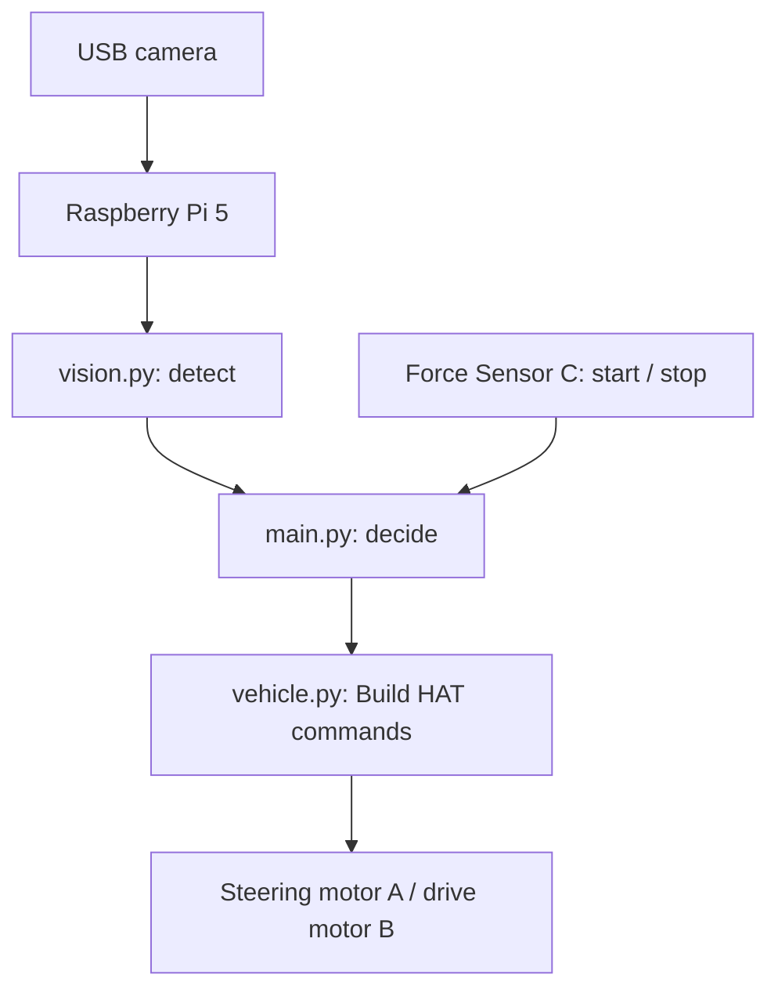
```mermaid
flowchart TD
    A["USB camera"] --> B["Raspberry Pi 5"]
    B --> C["vision.py: detect"]
    C --> D["main.py: decide"]
    E["Force Sensor C: start / stop"] --> D
    D --> F["vehicle.py: Build HAT commands"]
    F --> G["Steering motor A / drive motor B"]
```

**Figure 1. Current hardware and software data flow.** Port assignments for A and B are based on the current robot setup; the supplied `main.py` directly identifies only the Force Sensor on C.

| Part | Role |
| --- | --- |
| Raspberry Pi 5 | Runs Python, OpenCV, vision processing, and navigation decisions |
| USB camera | Supplies 640 × 480 frames, requested at 30 fps |
| Build HAT | Controls the LEGO motors and reads the Force Sensor |
| Steering motor, port A | Turns the front wheels through the steering linkage |
| Drive motor, port B | Drives the rear wheels |
| Force Sensor, port C | Start and second-press stop |

### Current vehicle photographs

These five views show the Raspberry Pi 5 and Build HAT vehicle, with its high-mounted Hiwonder USB camera, Force Sensor, LEGO motors, frame, and wiring. The [hardware overview](others/current-hardware.svg) summarizes their connections. The front is the end facing the camera lens. An underside view of this revision has not been supplied.

| Front, camera facing forward | Rear, camera board visible |
| --- | --- |
| 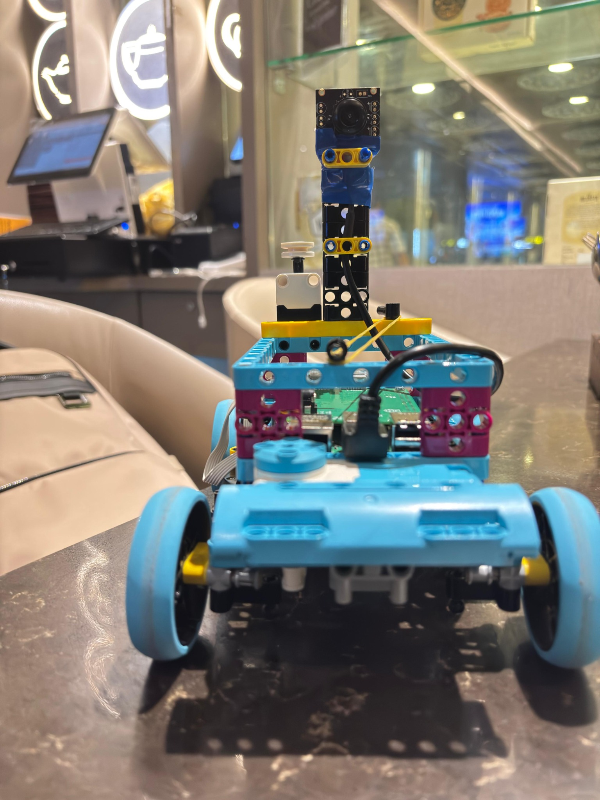 | 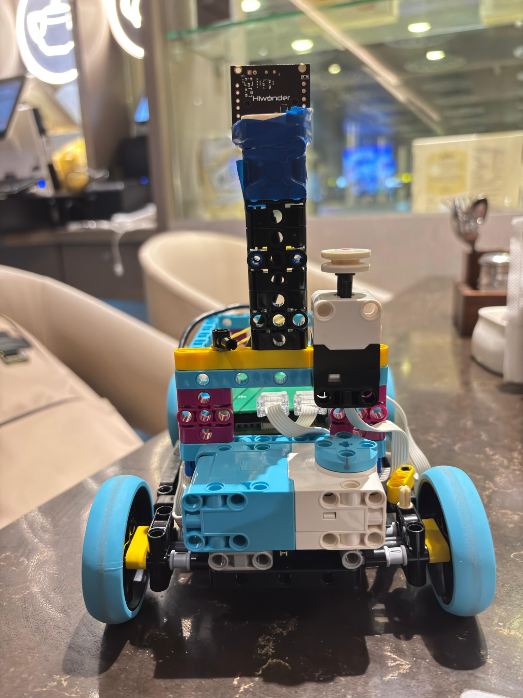 |

| Left side | Right side | Top |
| --- | --- | --- |
|  |  | 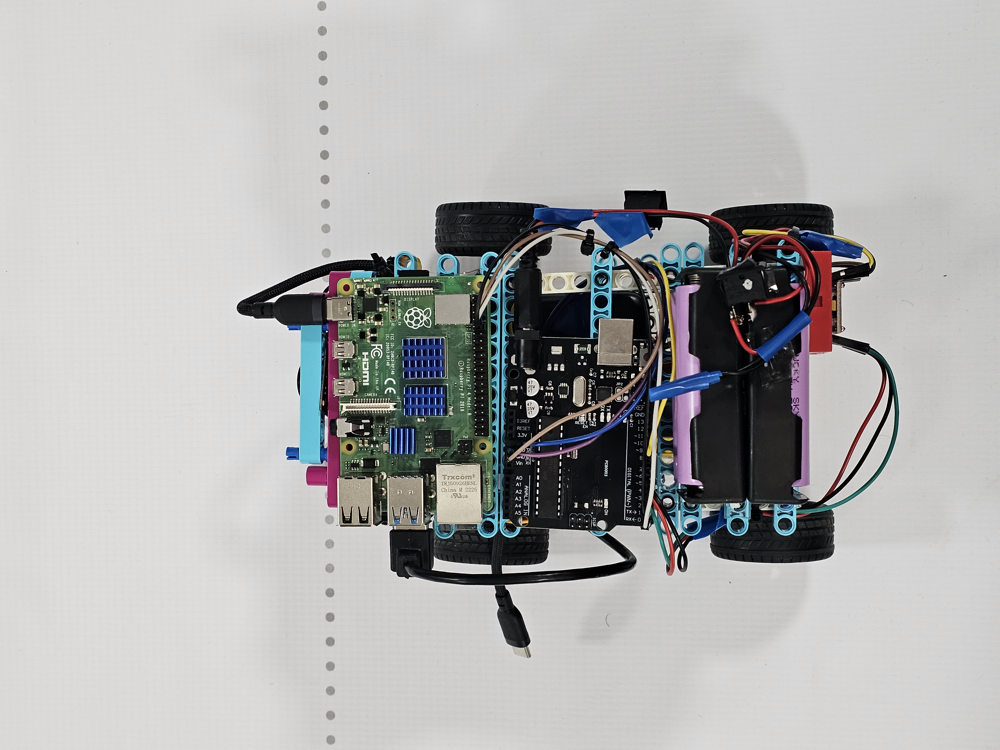 |

## Software structure

| File | Responsibility | Current repository status |
| --- | --- | --- |
| [`src/vision.py`](src/vision.py) | Camera acquisition, coloured line and pillar detection, dark wall ratios, direction lock, lap count, debug overlay | Supplied implementation; debug line counter corrected to show the 13-crossing stop target |
| [`src/main.py`](src/main.py) | Wait for start, choose the action each frame, handle corners and stopping | Uploaded exactly as supplied |
| [`src/vehicle.py`](src/vehicle.py) | Build HAT steering, driving, correction, stop, and centring | Added as a configurable starting implementation; calibrate on the robot |

The main loop checks conditions in this order:

1. **Second button press, camera failure, or Q:** leave the run.
2. **Race complete:** command straight for 0.5 seconds and leave the run.
3. **Green pillar:** call `vehicle.left()`.
4. **Red pillar:** call `vehicle.right()`.
5. **Front wall:** turn right if clockwise, or left if counterclockwise, until vision reports `FRONT_CLEAR`.
6. **Otherwise:** use `LEFT_CORRECT`, `RIGHT_CORRECT`, or straight driving from the vision navigation hint.

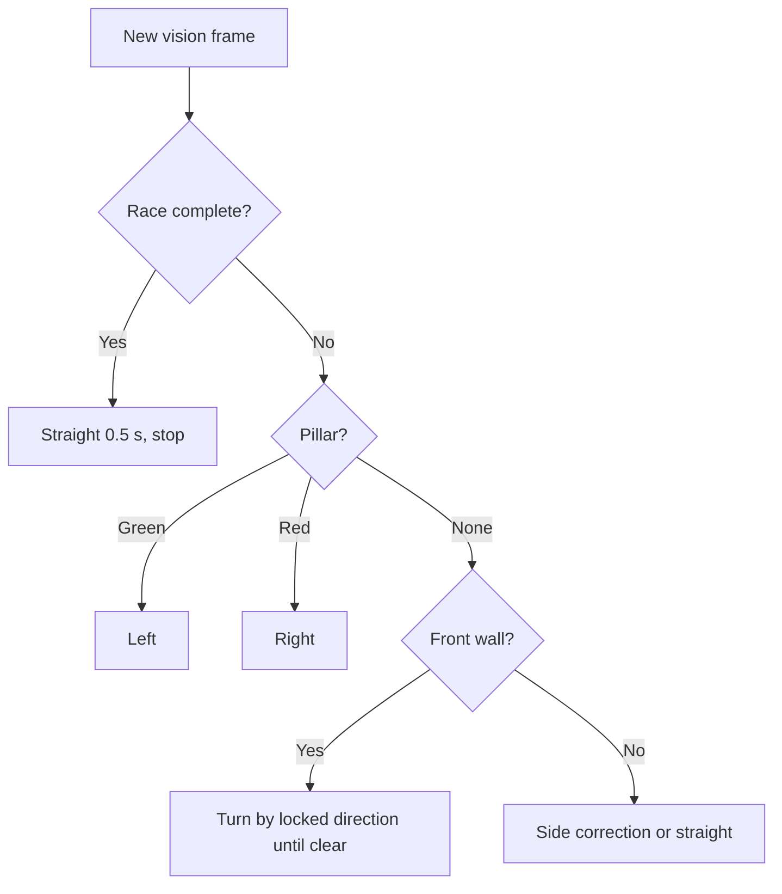
```mermaid
flowchart TD
    A["New vision frame"] --> B{"Race complete?"}
    B -->|Yes| C["Straight 0.5 s, stop"]
    B -->|No| D{"Pillar?"}
    D -->|Green| E["Left"]
    D -->|Red| F["Right"]
    D -->|None| G{"Front wall?"}
    G -->|Yes| H["Turn by locked direction until clear"]
    G -->|No| I["Side correction or straight"]
```

**Figure 2. Decision order in `main.py`.** The obstacle response is issued on each frame; this version does not include a timed obstacle lock or a reverse manoeuvre in `main.py`.

### Vehicle calibration

`src/vehicle.py` starts with port A for steering and port B for drive, a motor speed of 20, steering speed 30, centre 0°, full turn ±25°, and correction ±10°. These are **initial values, not measured settings**. Check wheel centring and rotation direction with the drive wheels lifted before a track run. Environment variables `TMM_STEERING_PORT`, `TMM_DRIVE_PORT`, `TMM_CENTER_ANGLE`, `TMM_TURN_ANGLE`, `TMM_CORRECTION_ANGLE`, `TMM_STEERING_SPEED`, `TMM_DRIVE_SPEED`, and `TMM_STEERING_DIRECTION` adjust the setup without editing the file. Set `TMM_STEERING_DIRECTION=-1` if left and right are reversed; use a negative drive speed if forward runs backward. The class sends nonblocking steering positions and keeps the drive motor running until `stop()`.

## Camera regions and detection

The current `vision.py` sets the following pixel coordinates in a 640 × 480 frame. Coordinates are `(x1, y1, x2, y2)`; the bottom of the image has a larger `y` value.

| Purpose | ROI | Processing |
| --- | --- | --- |
| Direction lock | `(20, 150, 620, 440)` | Orange and blue HSV masks; compare line centre `y` positions |
| Lap line | `(40, 220, 600, 440)` | Orange or blue contour, minimum line area 80 px² |
| Pillars | `(50, 210, 590, 455)` | Red/green HSV masks, area and shape validation |
| Left wall | `(20, 260, 150, 455)` | Ratio of dark pixels |
| Front wall | `(145, 205, 495, 350)` | Ratio of dark pixels |
| Right wall | `(490, 260, 620, 455)` | Ratio of dark pixels |

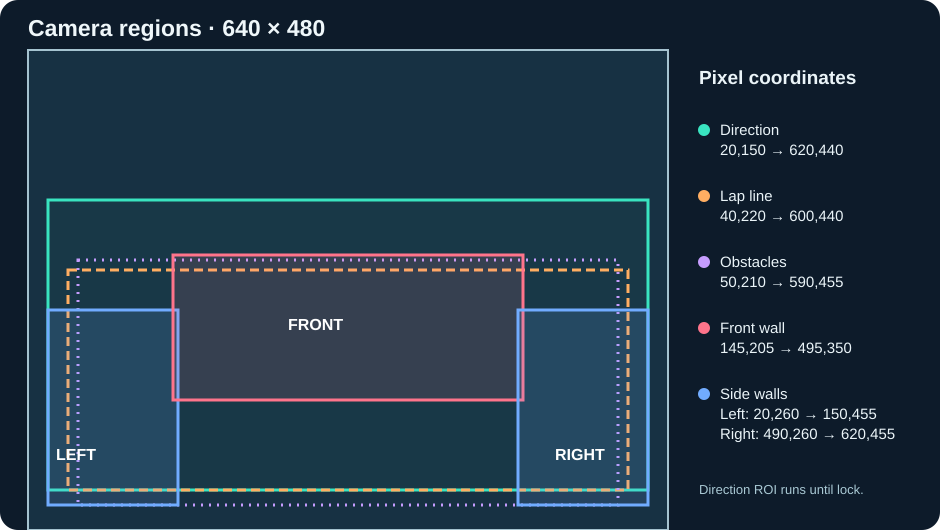

**Figure 3. Exact regions from `vision.py`.** The diagram uses the source coordinates.

### Camera views from track testing

These camera captures document field of view and detection overlays from a **development test program on 21 September 2026**. Its coloured boxes and pixel counters are not the output format of the current `src/vision.py`.

| Unannotated track view | Blue line in view |
| --- | --- |
| 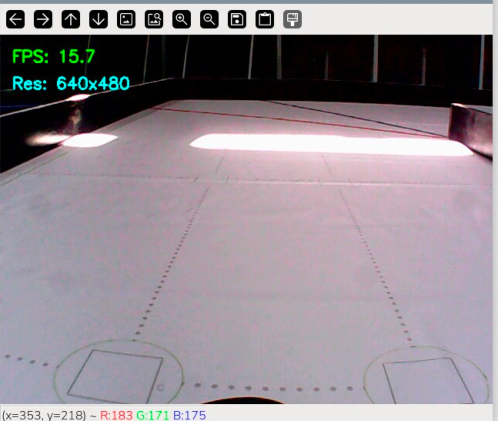 | 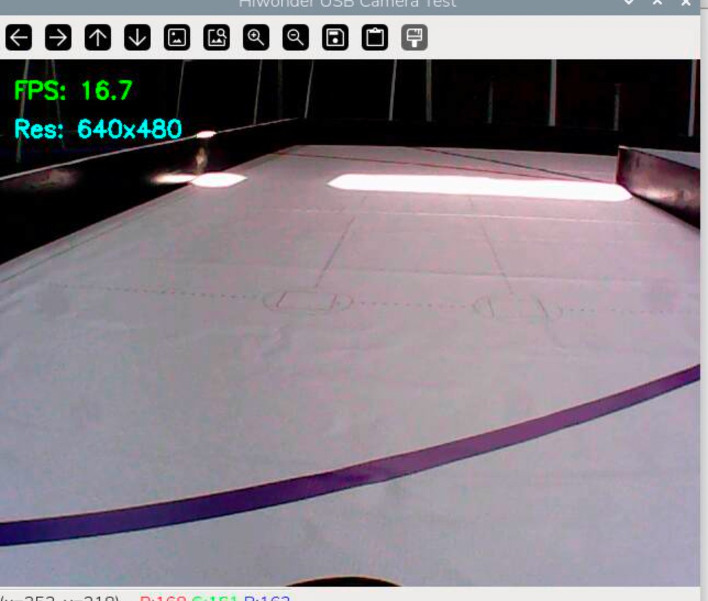 |

The earlier overlay below shows central and side inspection regions used while tuning camera placement.

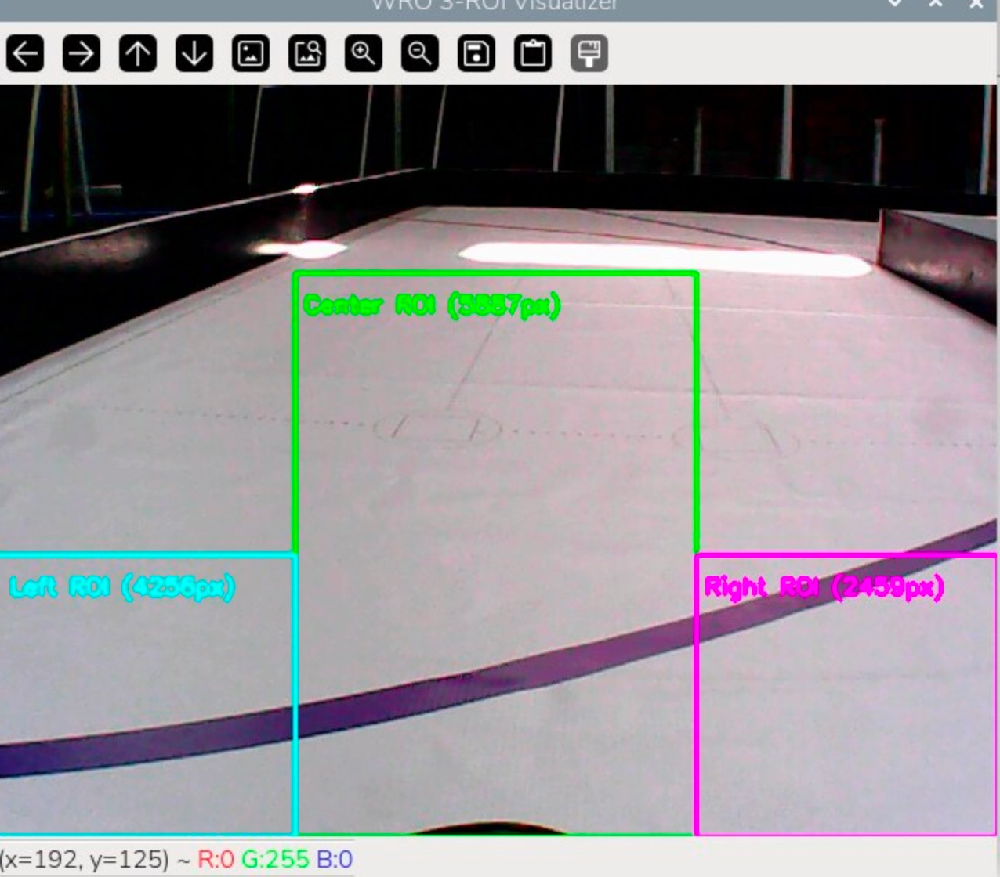

### Direction detection

Direction starts as `UNKNOWN`. Both orange and blue lines must be present inside the direction ROI. If their vertical centres differ by less than **20 pixels**, the observation is rejected. When orange has the larger `y` coordinate, it is closer to the bottom of the frame and the candidate direction is **CLOCKWISE**. When blue has the larger `y`, the candidate is **COUNTERCLOCKWISE**. The same ordering must be seen for **three consecutive frames** before direction locks. Once locked, the code does not reconsider it.

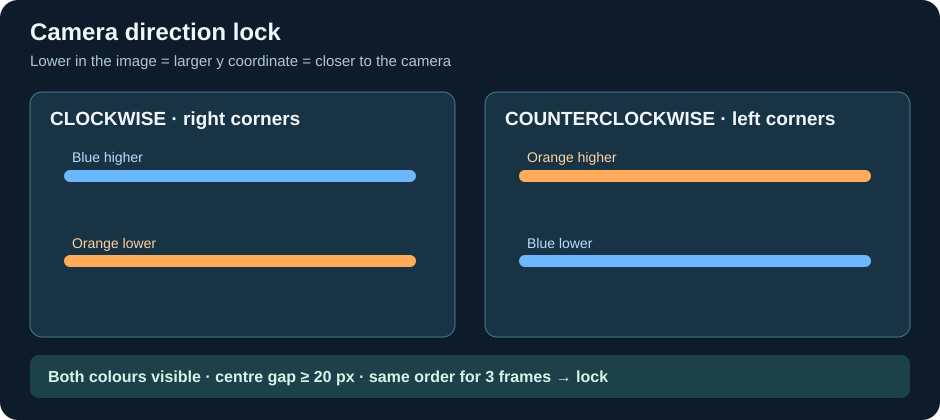

**Figure 4. Direction lock from orange and blue line positions.**

After direction locks, both start lines must disappear from the normal line ROI before lap counting is enabled. This prevents the start markings from being counted immediately.

### Walls and corners

The camera frame is converted to grayscale, blurred, thresholded at **100**, and morphologically opened before dark-pixel ratios are calculated. A front ROI ratio above **0.15** gives `FRONT_WALL`. A side ratio above **0.22** on only one side causes correction away from that side. When both sides are above threshold, the navigation hint is straight.

At `FRONT_WALL`, clockwise travel calls `vehicle.right()` and all other values, including `UNKNOWN`, call `vehicle.left()` repeatedly until a processed frame reports `FRONT_CLEAR`. The inner loop still checks the camera, Q, the button, and race completion. It does **not** have a turn timeout or a side-wall clearance check in the supplied `main.py`.

### Front wall detection during development

The following screenshots show how an earlier test overlay changed between a detected front wall and a clear front region. They are field-test evidence; their raw pixel counts and drawn rectangles should not be read as the current `vision.py` thresholds.

| Wall detected | Front region clear |
| --- | --- |
| 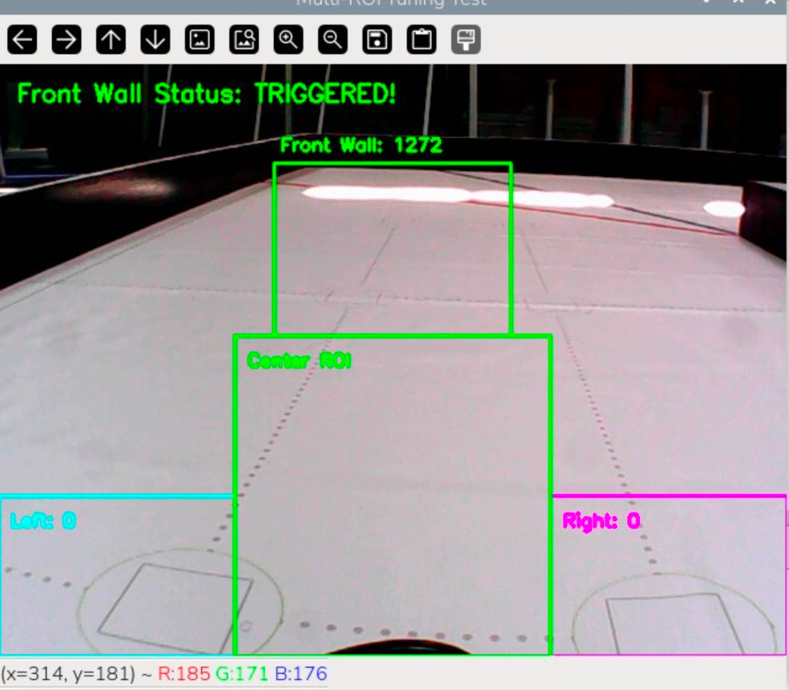 | 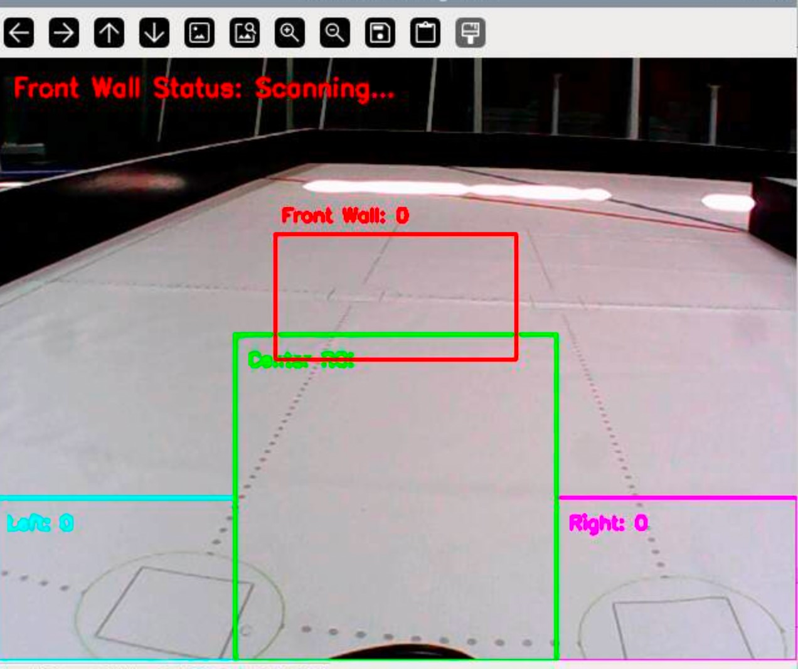 |

| Additional front-wall test | Side and front readings |
| --- | --- |
| 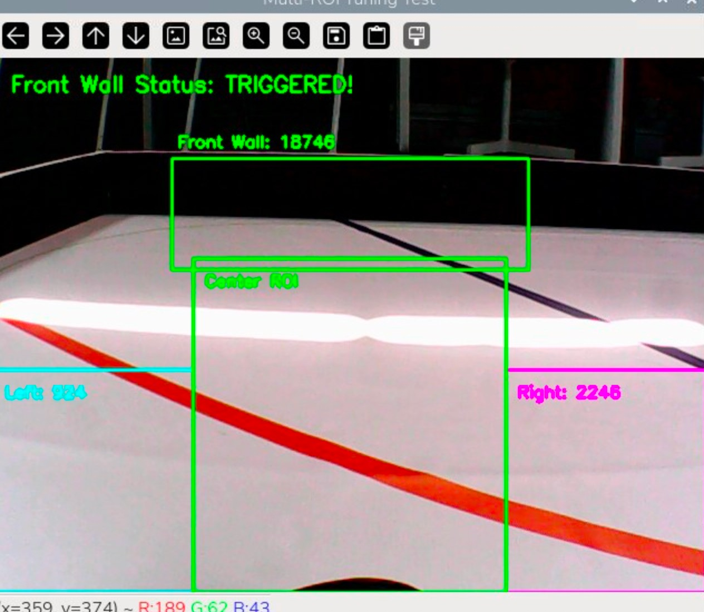 | 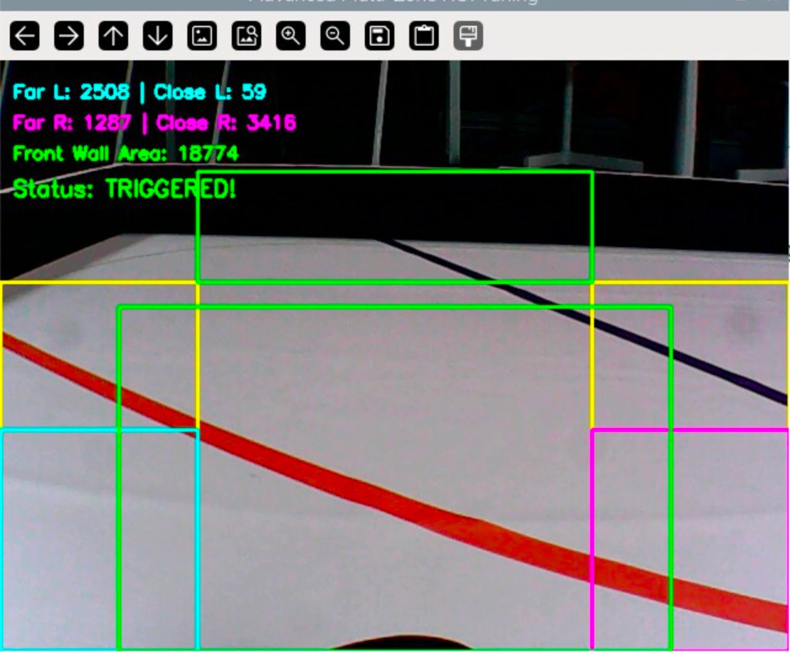 |

### Red and green pillars

The obstacle ROI uses HSV masks, a 3 × 3 closing operation, and contour checks. `MIN_GREEN_OBSTACLE_AREA` is **1000 px²** and `MIN_RED_OBSTACLE_AREA` is **1800 px²**; minimum height is **35 px** and maximum aspect ratio is **1.8**. If both colours pass validation, the larger contour area wins. The main loop steers **left for green** and **right for red**. These are steering commands, not proof of a safe physical clearance. Test both colours near corners and walls.

## Lap counting and stop

Either an orange or a blue line in the normal line ROI can count as one crossing. The counter locks while a line remains visible and rearms only after **five consecutive frames without either line**. Every fourth crossing reports a completed lap: **4 → lap 1, 8 → lap 2, 12 → lap 3**.

The configured `TOTAL_LINE_COUNT` is **13**. Crossing 13 sets `race_complete`; `main.py` then commands straight for 0.5 seconds and stops. The terminal message says “3 LAPS COMPLETED” at this stop reference. **This program does not contain a parking sequence.**

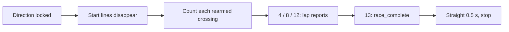
```mermaid
flowchart LR
    A["Direction locked"] --> B["Start lines disappear"]
    B --> C["Count each rearmed crossing"]
    C --> D["4 / 8 / 12: lap reports"]
    D --> E["13: race_complete"]
    E --> F["Straight 0.5 s, stop"]
```

**Figure 5. Line count sequence.**

## Start, stop, and cleanup

The program initializes `Vision`, `Vehicle`, and `ForceSensor("C")`, stops the vehicle, and displays a live debug view while waiting for the start press. It waits for the button to be released before entering the main loop. During the run, a second press, Q, or camera failure exits. The `finally` block stops the vehicle, centres steering, closes the camera, and destroys OpenCV windows.

**Current code checks before a full-speed run:**

- If a front wall appears while direction is `UNKNOWN`, the current conditional selects `vehicle.left()` because it treats every non-clockwise value as counterclockwise. Ensure direction locks before the first corner or add an explicit safe response.
- A corner turn can continue indefinitely if `FRONT_CLEAR` never appears. Add a bounded timeout or recovery before relying on this at speed.
- The waiting-for-start and button-release loops are outside `try/finally`. Pressing Q before the start raises `SystemExit` without executing the main cleanup block.
- The obstacle branch has no held bypass state or explicit wall-clearance check. Observe how the robot behaves when a pillar briefly leaves the camera view.
- The 0.5-second straight movement after crossing 13 needs track testing so the vehicle stops at the intended position.

## Testing evidence to add

| Test | Evidence |
| --- | --- |
| Direction in both start layouts | Debug overlay showing orange/blue centres, frame confirmation and locked direction |
| Straight and both corners | Continuous video and front/side wall ratios |
| Red and green avoidance | Continuous video, pillar contour and minimum clearance from wall and pillar |
| Pillar near a corner | Both colours tested with corner visible |
| Lap count | Continuous three-lap video with 4, 8, 12 and 13 crossing log |
| Emergency exits | Second button press, Q and camera-disconnect behaviour |

## Prototype history

The other Python files in `src/` and the pictures in [`archive/pi4-arduino/`](archive/pi4-arduino/) describe the earlier **Raspberry Pi 4B + Arduino Uno + servo/DC motor** iteration. These are engineering history and are separate from the current Build HAT program. The old `arduino/` folder has been removed.

To reproduce the current build accurately, add an underside photograph, verify the power and motor connections, and record tested motor calibration values. The current `src/vehicle.py` uses provisional port A for steering, port B for drive, and port C for the Force Sensor in `main.py`. The `models/` folder contained no runtime model and has been removed; its older steering photograph is under [`archive/pi4-arduino/models/`](archive/pi4-arduino/models/).

## References

- [WRO 2026 season resources](https://wro-association.org/competition/2026-season/)
- [Raspberry Pi Build HAT documentation](https://www.raspberrypi.com/documentation/accessories/build-hat.html)
- [OpenCV documentation](https://docs.opencv.org/)
