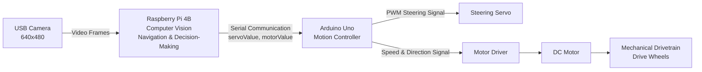

**WRO-FUTURE-ENGINEERS-2026_THE MECH MINDS**
   Welcome to the official technical repository for Team TMM's autonomous self-driving vehicle developed for the WRO Future Engineers category. This codebase powers our dual-microarchitecture robot engineered for precision wall-keeping, dynamic obstacle avoidance, robust lap counting, and automated parallel parking.

## Team members: 
Ahmed Suleiman, Ismail Nassor, & Hajer Al Salmani. 
Coach: Alex Savariyar.

## Table of contents:
1. system Overview.
2. Hardware Components.
3. Power System & Safety.
4. Wiring.
5. Raspberry Pi Setup.
6. Software Environmnet.
7. GPIO Pin Assignment.
8. Design Decisions & Iteration.
9. Autonomous Driving Strategy.
10. Running Autonomously at Boot.
11. Safe Shutdown.
12. Pre-Run Checklist.
13. Troubleshooting.
14. Repository Structure.

## 1. System Overview

Our robot uses a **hybrid control architecture** in which the **Raspberry Pi 4B** performs computer vision, autonomous navigation, and decision-making, while the **Arduino Uno** handles real-time steering and motor control.

This separation allows the Raspberry Pi to focus on computationally intensive vision processing while the Arduino provides stable and responsive control of the robot's actuators.

### Raspberry Pi 4B – Vision and Decision-Making

The Raspberry Pi 4B acts as the main processing unit of the robot. A 640×480 wide-angle USB camera continuously provides images of the track. These frames are processed using an OpenCV-based Python program.

The Raspberry Pi is responsible for:

* Capturing and processing live camera frames.
* Processing selected **Regions of Interest (ROI)** for navigation.
* Detecting track boundaries for wall-based navigation.
* Detecting **red and green traffic pillars** and determining the appropriate avoidance direction.
* Detecting the **blue lap-counting line**.
* Applying debounce logic to prevent repeated lap counts.
* Tracking lap progress, where **12 validated blue-line detections represent three completed laps**.
* Managing navigation states such as normal driving, obstacle avoidance, lap completion, parking search, and parallel parking.
* Calculating the required steering position and motor speed.
* Sending steering and motor commands to the Arduino Uno through serial communication.

### Arduino Uno – Motion Control

The Arduino Uno acts as the robot's low-level motion controller.

It receives steering and motor commands from the Raspberry Pi through serial communication and converts them into stable signals for the steering servo and drive motor.

The communication packet follows the format:

`servoValue,motorValue`

For example:

`1050,120`

The first value represents the steering command and the second value represents the motor command.

The Arduino Uno is responsible for:

* Receiving serial commands from the Raspberry Pi.
* Validating the received command values.
* Generating the required PWM signal for the steering servo.
* Applying steering-direction correction according to the mechanical steering arrangement.
* Controlling the motor driver.
* Controlling the direction and speed of the DC drive motor.
* Maintaining stable actuator control independently of the Raspberry Pi's computer-vision workload.
* Applying a communication watchdog to stop the robot if valid commands are not received within the expected time.

### System Components

| Subsystem             | Main Component                     | Function                                                                               |
| --------------------- | ---------------------------------- | -------------------------------------------------------------------------------------- |
| **Perception**        | 640×480 wide-angle USB camera      | Captures the track, traffic pillars, lap-counting line, and parking markers            |
| **Main Processing**   | Raspberry Pi 4B                    | Performs computer vision, autonomous navigation, decision-making, and state management |
| **Motion Controller** | Arduino Uno                        | Receives motion commands from the Raspberry Pi and controls the actuators              |
| **Steering**          | Servo motor                        | Controls the steering angle of the front wheels                                        |
| **Motor Control**     | Motor driver                       | Controls the direction and speed of the DC drive motor                                 |
| **Propulsion**        | DC motor and mechanical drivetrain | Transfers motor power to the drive wheels                                              |
| **Power System**      | Separate regulated power supplies  | Provides stable power to the Raspberry Pi, Arduino, servo, and drive system            |

### System Data Flow Diagram



### Control Flow

The overall control sequence of the robot is:

**Camera → Raspberry Pi → Arduino Uno → Steering Servo / Motor Driver → DC Motor → Drive Wheels**

1. The **USB camera** captures the track environment.
2. The **Raspberry Pi 4B** processes the camera frames using OpenCV.
3. The Raspberry Pi determines the required steering position and motor speed.
4. The steering and motor values are transmitted to the **Arduino Uno** through serial communication.
5. The Arduino generates the required PWM signal for the **steering servo**.
6. The Arduino sends speed and direction signals to the **motor driver**.
7. The motor driver controls the **DC drive motor**.
8. The mechanical drivetrain transfers motor rotation to the drive wheels.

## 2. Hardware Components

The robot uses the following main electronic, mechanical, and power components.

|   No. | Component                         | Image                                              | Specification / Function                                                                                                                                                                                                                                                     |
| ----: | --------------------------------- | -------------------------------------------------- | ---------------------------------------------------------------------------------------------------------------------------------------------------------------------------------------------------------------------------------------------------------------------------- |
| **1** | **Controller & Vision Processor** |  | **Raspberry Pi 4B** — Runs Python and OpenCV computer-vision pipelines. Handles Region of Interest (ROI) wall tracking, red/green traffic-pillar detection, edge-debounced blue-line lap counting, autonomous navigation, and the parallel-parking state machine.            |
| **2** | **Camera**                        |       | **USB Camera — 640×480, 30 fps, ~130° FOV** — Provides real-time visual input for track observation, wall detection, traffic-pillar detection, lap-line detection, and parking-marker recognition.                                                                           |
| **3** | **Motor Driver**                  |     | **TB6612-type Dual DC Motor Driver** — Interfaces between the Arduino Uno, motor power supply, and DC motors. Controls motor direction and speed.                                                                                                                            |
| **4** | **Drive Motors**                  |        | **2 × DC Motors** — Provide propulsion to the robot through the mechanical drivetrain.                                                                                                                                                                                       |
| **5** | **Steering Mechanism**            |   | **3-Wire Hobby Servo** — Controls the front-wheel steering mechanism according to steering commands received from the Arduino Uno.                                                                                                                                           |
| **6** | **Steering & Motor Coprocessor**  |      | **Arduino Uno** — Receives continuous CSV command packets (`servoVal,motorVal\n`) from the Raspberry Pi through hardware UART (`/dev/serial0`). It generates the servo PWM signal and controls the motor driver, offloading low-level actuator timing from the Raspberry Pi. |
| **7** | **Raspberry Pi Power Supply**     |       | **30 W USB Power Bank — 5 V / 3 A output** — Provides a stable independent power supply for the Raspberry Pi.                                                                                                                                                                |
| **8** | **Motor Power Supply**            |     | **7.4 V Battery Pack** — Supplies the motor driver's VM power rail for robot propulsion.                                                                                                                                                                                     |
| **9** | **Servo Power Supply**            |         | **5–6 V Regulated BEC / Buck Converter** — Supplies stable power to the steering servo without drawing high current from the Raspberry Pi or Arduino power rails.                                                                                                            |
## 3. Mobility & Mechanical Design

Our robot uses a **four-wheel automotive-style layout** with front-wheel steering and rear-wheel propulsion.

The drivetrain uses **two DC geared motors**, both connected through gears to the **same rear axle**. The rear wheels are therefore mechanically linked and are not controlled independently.

### Chassis and Drivetrain

```text
     DC Motor 1        DC Motor 2
          │                 │
          ▼                 ▼
        Gear              Gear
           \               /
            \             /
             Common Rear Axle
                /       \
               ▼         ▼
          Rear Left   Rear Right
             Wheel       Wheel
```

Using two motors provides additional torque while keeping both rear wheels mechanically connected through the same axle.

### Steering Mechanism

The two front wheels are controlled by a single servo through a steering linkage.

```text
          Steering Servo
                │
                ▼
        Steering Linkage
           /         \
          ▼           ▼
    Front Left    Front Right
       Wheel         Wheel
```

Steering is controlled independently from propulsion, giving the vehicle predictable automotive-style movement.

### Torque and Speed Considerations

The drivetrain was designed to balance **speed and torque**.

Higher torque helps the robot accelerate reliably and overcome drivetrain friction, while excessive speed can reduce stability and make obstacle detection and steering corrections less reliable.

The final motor speed and gearing are therefore selected based on **consistent track performance rather than maximum speed**.

### Design Trade-Offs

| Design Choice            | Advantage                          | Trade-Off                                    |
| ------------------------ | ---------------------------------- | -------------------------------------------- |
| **Two DC motors**        | Higher available torque            | Increased power consumption                  |
| **Common rear axle**     | Simple and reliable drivetrain     | Some wheel slip may occur during tight turns |
| **Gear transmission**    | Allows speed and torque adjustment | Requires accurate alignment                  |
| **Front servo steering** | Precise directional control        | Requires careful calibration                 |

### Mechanical Testing

The drivetrain and steering system are tested for:

* Straight-line movement
* Steering-centre accuracy
* Turning radius
* Motor speed and torque
* Gear alignment
* Rear-wheel traction
* Chassis stability

Mechanical adjustments are made based on repeated track testing to improve reliability and consistency.

### Final Mobility Architecture

The final vehicle uses **two mechanically coupled DC motors driving a common rear axle through gears, combined with servo-controlled front-wheel steering**.

## 4. Electrical System & Circuit Diagram

The electrical system separates the computing, motor, and servo power supplies to improve stability and reduce electrical noise. The Raspberry Pi communicates with the Arduino Uno through serial communication, while the Arduino controls the steering servo and motor driver.


  3. Power System & Safty
     - A 30W power bank is sufficient for the Pi 4B, provided it supplies 5V/3A.
     - Never connect the 7.4V battery directly to a Raspberry Pi 5V pin. The power bank powers the Pi; the 7.4V battery is used only for the motor-driver VM input.
     - Do not power a standard 5-6V servo directly from 7.4V unless that servo is explicitly rated for 2S/7.4V operation, use a regulated 5-6V BEC/buck converter instead.
     - The Pi, motor driver, and servo supply all share a common ground. Without this, GPIO signal levels become unreliable and the servo can behave erratically even when the logic is correct.
     - Always lift the driven wheels off the ground for first motor and steering test, before any floor testing.
     - The Arduino Uno is powered over the same USB cable used for serial communication with the Pi. The servo's power (not signal) still comes from the 5-6V BEC/buck, not from the Arduino's own 5V pin, since the Arduino cannot supply enough current for a servo on its own.

4. Wiring
   4.1 Power distribution
   - 30W power bank → Raspberry Pi USB-C power input.
   - 7.4V battery + → Motor driver VM.
   - 7.4V battery - → Motor driver GND.
   - Pi GND → Motor-driver GND.
   - Servo + → 5-6V regulated BEC/buck output.
   - Servo GND → BEC/buck GND and Pi common GND.

   4.2 Motor driver
   - (pin numbers could be different)
   - (AIN1) connect to (GPIO17) Pin 11
   - (AIN2) connect to (GPIO27) Pin 13
   - (BIN1) connect to (GPIO22) Pin 15
   - (BIN2) connect to (GPIO23) Pin 16
   - (STBY) connect to (GPIO24) Pin 18
   - (GND) connect to (Pi GND) Pin 6 or another Pi GND
   - (VM) connect to (7.4V battery +) Motor supply
   - (GND) connect to (7.4V battery -) common ground
   - (AO1/AO2) connect to (Motor A) Motor output
   - (BO1/BO2) connect to (Motor B) Motor output
 (This pinout follows the labels printed on the board actually used for testing).

   4.3 Steering servo
   -servo wires:
   - Orange/yellow/white:
     function: signal
     connection: Arduino Uno pin D9 (PWM-capable) [no longer connected to the Pi directly]. 
   - Red:
     function: +5V power
     connection: 5-6V regulated BEC/buck
   - Brown/Black:
     function: Ground
     connection: Common GND (Pi GND, Arduino GND, and BEC/buck GND all tied together).

  **not finalize**
  4.4 Arduino Uno connection
   - Arduino USB port → Raspberry Pi USB port (carries both power to the Arduino and the serial data link).
   - Arduino D9 → Servo signal wire.
   - Arduino GND → Common ground (same ground as Pi, motor driver, and BEC/buck).
   - The Pi sends steering commands to the Arduino as simple serial messages; the Arduino sketch reads these and converts them into the servo PWM signal itself.

5. Raspberry Pi Setup
   Build configuration used:
   - Hostname: tmm
   - Username: pi
   - SSH: Enabled
   - SSH authentication: password authentication
   - Wi-Fi: phone hotspot or local Wi-Fi
     
   5.1 connect over SSH
     ssh pi@tmm.local
   if the host identification changes (like after re-flashing the SD card):
     ssh-keygen -R tmm.local
     ssh pi@tmm.local

   5.2 Arduino setup
   - Install the Arduino IDE on the development machine used to program the Arduino.
   - Upload arduino/steering_servo.ino to the Arduino Uno over USB before connecting it the Pi for normal operation.
   - Confirm the Arduino's serial port name/number
   - **********

   5.3 Remote desktop (VNC)
   (enable VNC from Raspberry Pi configuration rather than running a standalone server, so the VNC session shares the active desktop instead of creating a sperate one)
   sudo raspi-config
   sudo reboot
connect from a VNC viewer to tmm.local (or the IP from hostname -I).
only use a standalone TigerVNC server (tigervnc-standalone-server, vncserver :1) if a separate virtual desktop session is specifically needed, it does not share the Pi's physical desktop.

6. Software Environment
   sudo apt update
   sudo apt install -y python3-lgpio python3-opencv python3-smbus2 i2c-tools
   verify:
   python3 -c "import lgpio; print('lgpio OK')"
   python3 -c "import cv2; print('OpenCV OK')"
   python3 -c "import smbus2; print('smbus2 OK')"
(Raspberry Pi OS Trixie: don't rely on the older pigpio daemon package for this build, all GPIO code in this project uses lgpio)

7. GPIO Pin assignment
   - Motor A IN1: GPIO17 - PIN 11
   - Motor A IN2: GPIO27 - PIN 13
   - Motor B IN1: GPIO22 - PIN 15
   - Motor B IN2: GPIO23 - PIN 16
   - Motor driver STBY: GPIO24 - PIN 18
   - Steering servo signal: GPIO18 - PIN 12
   - Ground: GND - 6 (or another GND pin)
   - GPIO18 is now free (previously the steering servo signal) - steering is handled by the Arduino Uno instead (section 4.4). Servo signal is now on Arduino pin D9, not a Pi GPIO pin.

9. Design decisions & Iteration
   [This section document the reasoning behind the current configuration, what was tried, what failed, and why the final values were chosed. (see /src for the tested scripts referenced below).]
- **Motor direction mapping.** Initial GPIO-level testing (AIN1=1/AIN2=0) drove the robot backward relative to its physical chassis orientation. Rather than rewire the driver board, the fix was applied in software: the verified physical-forward mapping is (AIN1=0, AIN2=1, BIN1=1, BIN2=0). (All later test scripts and the autonomous program use this corrected mapping, any future script must match it or the robot will reverse its intended direction).
- **Steering calibration.** Earlier pulse values (Right=700, center=1000, left=1300) pushed the servo close to it mechanical end stops, risking gear strain and inconsistent centering. The values were pulled in to (right=850, center=1000, left=1150), a deliberately softer range that keeps the servo within safe mechanical travel while still producing a usable steering angle.
- **GPIO Library choice**. lgpio was chosen over the legacy pigpio daemon because Raspberry Pi OS Trixie does not reliably support the gipio background daemon this project would otherwise depend on. lgpio needs no daemon and matches the current OS.
- **Servo idle state**. lgpio.tx_servo(h, servo, 0) stops pulse output, it does not command a 0° angle. Every test and the main program explicitly re-centers the servo (steer_center) before cutting the pulse, so the wheels don't default to an unpredictable angle when the program exits.
- **Startup sequencing**. The autonomous program centers the steering servo and waits before enabling STBY and driving the motors, so the robot never lurches or steers hard immediately after power-on.
- **Steering moved from the Pi to a dedicated Arduino Uno**. Driving the servo directly from the Pi (via lgpio's software-generated PWM) caused visible jitter, and the servo would fail to hold a commanded steering angle, drifting back toward straight.
  - The cause: lgpio generates servo pulses in software, sharing the same CPU that is simultaneously running the camera/OpenCV loop - when frame processing gets CPU-intensive, pulse timing to the servo becomes irregular, which the servo interprets as an unstable signal.
  - The fix: steering was offloaded to an Arduino Uno, which has a dedicated hardware timer for generating PWM signals that is not affected by anything else the microcontroller is doing. The Pi now sends steering commands to the Arduino over USB serial instead of generating the servo pulse itself; the Arduino's onboard timer produces a stable, jitter-free signal regardless of camera-processing load. Motor control (which does not need microsecond-precision timing the way servo position does) remains on the Pi's GPIO as before.

  9. Autonomous Driving Strategy
      The current implimintation:
     1. Both drive motors run forward continuously.
     2. The camera captures frames and works only on the lower half of the frame (frame [240:480, 0:640]) as the region of interest, reducing noise from the upper field of view and barrel distortion introduced by the wide-angle lens.
     3. The frame is converted to HSV and thresholded for red (two hue ranges, since red wraps around 0°/180° in HSV) and green.
     4. The largest contour area for each color is compared against a minimum-area threshold (MIN_AREA = 500) to reject noise.
     5. Steering decision:
        - Green detected (area > threshold > red area) → steer left.
        - Red detected (area > threshold > green area) → steer right.
        - otherwise → steer center (straight).
      6. The steering decision is sent to the Arduino Uno as a serial command; the Arduino converts it into the actual servo PWM signal. The Pi no longer generates the servo signal itself. HSV ranges must be re-tuned under actual competition lighting before relying on this logic in a run.
- (src/color_steering.py) → decision logic only
- (src/autonomous_main.py) → full integrated loop, for the tested implementations.

10. Running autonomously at Boot
    A 'systemd' service starts the robot program automatically on power-up.
    # /etc/systemd/system/robot.service
[Unit]
Description=WRO Robot Startup
After=multi-user.target

[Service]
Type=simple
User=pi
WorkingDirectory=/home/pi
ExecStartPre=/bin/sleep 5
ExecStart=/usr/bin/python3 /home/pi/motor_test_final.py
Restart=no

[Install]
WantedBy=multi-user.target

sudo systemctl daemon-reload
sudo systemctl enable robot.service
sudo systemctl start robot.service
sudo systemctl status robot.service

Diagnostics:
journalctl -u robot.service -b --no-pager
ls -l /home/pi/motor_test_final.py

11. Safe shutdown
    sudo shutdown -h now
wait until the Pi has fully halted and all activity LEDs stop before disconnecting power. Removing power while Linux is still writing to storage can corrupt the filesystem.

 12. Pre-Run Checklist
     - Pi powered from a 30W power band with a 5V/3A capable output.
     - Motor driver VM receives 7.4V battery power; polarity checked.
     - Pi GND, motor-driver GND, and servo-supply GND are common.
     - Arduino Uno connected to the Pi over USB, with steering_servo.ino already uploaded to it.
     - Arduino's serial port name confirmed on the Pi (ls/dev/tty*) and matches SERIAL_PORT in the code.
     - Servo signal connected to Arduino pin D9 (not a Pi GPIO pin).
     - Steering center verified at 1000µs before allowing the robot to move.
     - Steering range confirmed: RIGHT 850, CENTER 1000, LEFT 1150.
     - Both motors rotate in the physical forward direction (A: 0/1, B: 1/0).
     - Camera's assigned device number checked right before the run (Linux can assign a different number than last time) and confirmed to match what the program is set to read from.
     - Robot tested first with wheels lifted, then at low speed on the floor.
     - Boot service tested manually before relying on autonomous power-on.
     - A safe method exists to stop the robot and shut down the Pi.
    
13. Troubleshooting (problem → check/fix)
    - SSH host key changed → ssh-keygen _R tmm.local, then reconnect,
    - Cannot find Pi → ping tmm.local; check hotspot/Wi-Fi; use hostname -I on the Pi directly.
    - VNC freezes/ disconnects → confirm the Pi is reachable via pin/SSH first; reboot if needed.
    - 'systemd' service fails with 'status=2' → ExecStart path is wrong, verify the exact filename with ls -l.
    - Robot moves backward → Use the final physical-forward mapping: A 0/1, B 1/0.
    - Motor does not move → Check VM battery, common ground, STBY=HIGH, and motor output terminals.
    - Servo moves to mechanical end → Use the softer calibration values: 850/1000/1150.
    - Servo causes Pi instability → Power the servo from a separate 5-6V BEC/buck, sharing only ground with the Pi.
    - USB camera not detected → check lsusb and /dev/video*; try 'videoCapture (0, cv2.CAP_V4L2).
    - OpenCV window unavailable over SSH → Use a VNC desktop, or run headless and log decisions instead of cv2.imshow.
    - I²C scan empty on old adapter → Adapter/controller may be disconnected or faulty; the current motor-driver build avoids this dependency.
   
Useful commands:
- SSH from Mac → ssh pi@tmm.local
- IP address → hostname -I
- Hostname → hostmane
- USB device → ls /dev/video*
- GPIO config → pinctrl get 18
- Reboot → sudo reboot
- shutdown → sudo shutdown -h now
- Service status → sudo systemctl status robot.service
- Service logs → jounalctl -u robot.service -b --no-pager

