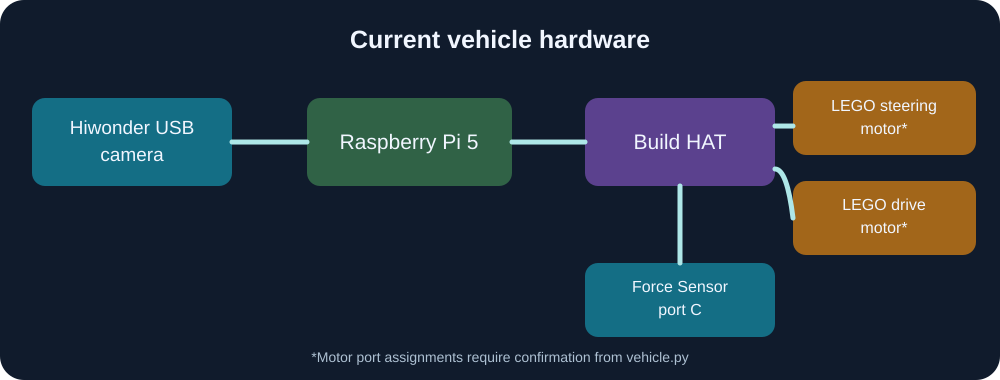

# Current robot hardware

The current vehicle uses a Raspberry Pi 5, Raspberry Pi Build HAT, Hiwonder USB camera, LEGO steering and drive motors, and a Force Sensor connected to Build HAT port C. See the [five current vehicle views](../README.md#current-vehicle-photographs) for the actual assembly and [software overview](../README.md#software-structure) for the control flow.

The diagram shows the control connections documented for this build. The supplied `main.py` confirms the Force Sensor on port C; verify the motor port assignments against the still-missing `src/vehicle.py` before wiring.

The older Raspberry Pi 4B and Arduino pictures have been moved to [`archive/pi4-arduino/`](../archive/pi4-arduino/). They document an earlier prototype.
